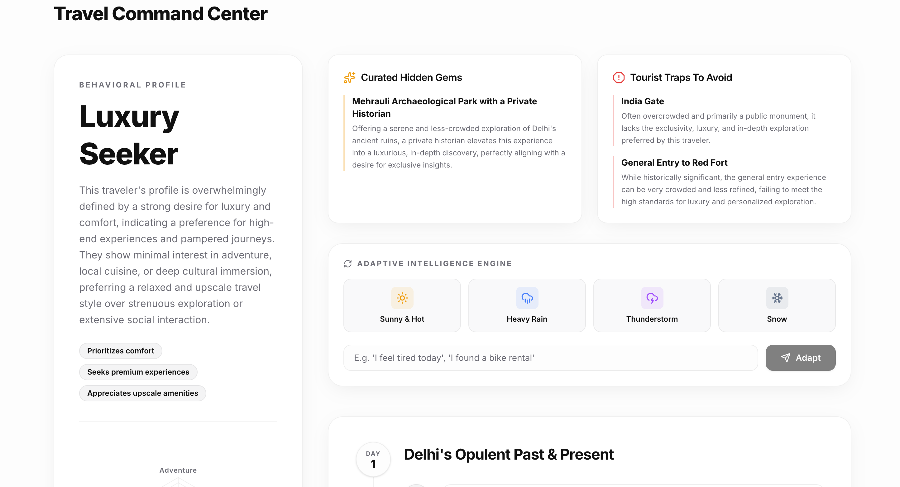

  
  <h1 align="center">Travel DNA 🧬✈️</h1>
  

    <strong>Most planners ask where you're going. We ask who you are.</strong>
  

  

    <a href="#-the-vision">Vision</a> • 
    <a href="#-how-it-works">How It Works</a> • 
    <a href="#-the-wow-factor">The Wow Factor</a> • 
    <a href="#-technical-architecture">Architecture</a> • 
    <a href="#-getting-started">Run Locally</a>
  

 

> **Travel DNA** is a production-ready, AI-native travel personality engine. It fundamentally rethinks trip generation by mapping your **psychological travel archetype** first, and then synthesizing hyper-personalized, adaptive itineraries that change dynamically with the real world.

---

## 📸 See It In Action

### The Command Center & Travel DNA Analysis
The intelligent dashboard breaks down your behavioral profile, actively curates hidden gems you'll love, and flags tourist traps you'll hate based strictly on your DNA. 

*(Note: Place your first screenshot here as `public/screenshots/dashboard-analysis.png`)*

### The Adaptive Timeline
Our AI generates a structured, day-by-day JSON timeline. When environmental factors change (like sudden rain), the Adaptive Engine recalculates the timeline seamlessly.

*(Note: Place your second screenshot here as `public/screenshots/dashboard-timeline.png`)*

---

## 🔮 The Vision

The current state of AI travel planners is broken. They are glorified search engines that take a destination and spit out generic top-10 lists. 

**Travel DNA changes the paradigm.** 
We believe the perfect trip isn't about *where* you go, but *how* you experience it. An introvert seeking culture needs a vastly different Paris itinerary than an extrovert seeking luxury and nightlife. Travel DNA acts as your digital travel psychologist.

## ✨ How It Works

1. **The Behavioral Quiz**: A beautiful, frictionless 10-point psychological assessment that tracks your traits across 6 distinct vectors: `Adventure`, `Food`, `Culture`, `Luxury`, `Social`, and `Exploration`.
2. **Instant DNA Analysis**: The engine assigns you a unique archetype (e.g., *"The Luxury Escapist"*) and plots your behavioral signature on a premium Radar Chart.
3. **AI Journey Synthesis**: Using Gemini 2.5 Flash, the engine ingests your DNA vector and synthesizes a deeply personalized, time-stamped itinerary.

---

## 🚀 The Wow Factor

We didn't just build an itinerary generator. We built an **Adaptive Intelligence Engine**.

* 🛑 **Anti-Tourist Traps**: The AI explicitly cross-references your DNA to filter out popular locations you will fundamentally dislike, explaining exactly *why* you should avoid them.
* 💎 **Curated Hidden Gems**: Surfaces underrated, non-touristy locations tailored to your specific travel style.
* 🌦️ **Real-Time Weather Simulator**: A sticky dashboard that lets you inject environmental chaos. Hit "Heavy Rain", "Thunderstorm", or "Snow", and watch the Timeline elegantly spin and recalculate all outdoor activities into indoor alternatives in real-time.

---

## 🛠️ Technical Architecture

Built specifically to push the boundaries of what is possible in modern SaaS architecture, featuring Apple/Linear-level aesthetic polish and highly structured LLM outputs.

- **Framework**: Next.js App Router (React 18)
- **Styling**: Tailwind CSS, PostCSS, Lucide Icons
- **Animation**: Framer Motion (Micro-interactions, Page Transitions)
- **Data Visualization**: Recharts (Dynamic Radar Charts)
- **Generative AI**: `@google/generative-ai` (`gemini-2.5-flash`) via Serverless Route Handlers
- **State Management**: React Hooks + LocalStorage Hydration

---

## 💻 Getting Started (Local Dev)

### Prerequisites
- Node.js (v18+)
- A Google Gemini API Key

### 1. Clone & Install
\`\`\`bash
git clone https://github.com/Devgr72/Travel-DNA.git
cd Travel-DNA
npm install
\`\`\`

### 2. Environment Setup
The app requires an API key to run the Generative AI engine.
\`\`\`bash
cp .env.example .env.local
\`\`\`
Add your key inside `.env.local`:
\`\`\`env
GEMINI_API_KEY=your_key_here
\`\`\`

### 3. Run the Matrix
\`\`\`bash
npm run dev
\`\`\`
Visit [http://localhost:3000](http://localhost:3000) to discover your Travel DNA.

---

  
Built with ❤️ and ☕ for the Hackathon

  
<strong>Design Philosophy:</strong> Make it simple, but significant.

