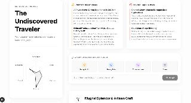
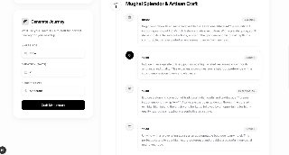

# Travel DNA — AI Travel Planning & Experience Engine

> **Challenge statement:** *Travel Planning & Experience Engine — plan trips dynamically with preferences, constraints, and real-time updates.*

Travel DNA is a production-quality, AI-native travel personality engine. It maps your **psychological travel archetype** across six dimensions, then synthesizes hyper-personalized, constraint-aware itineraries that adapt dynamically to real-world changes.

---

## Screenshots

### Travel Command Center — DNA Analysis


### Adaptive Timeline with Constraint Badges


---

## How It Works

1. **Behavioral Quiz** — 10-question assessment tracks six trait vectors: `Adventure`, `Food`, `Culture`, `Luxury`, `Social`, `Exploration`.
2. **DNA Analysis** — Gemini 2.5 Flash assigns a unique archetype title and plots your signature on an interactive Radar Chart.
3. **Constrained Journey Synthesis** — Enter a destination, duration, budget tier, and optional constraints (daily USD cap, mobility, dietary, must-avoid). The AI respects every constraint and surfaces a `constraintWarning` when one cannot be fully met.
4. **Adaptive Re-planning** — Inject a real-time context ("Heavy rain", "I feel tired") and the engine re-plans *only affected activities* in one round-trip — never regenerates the whole trip.

---

## Evaluation Criteria → Implementation Proof

| Criterion | Score Target | Key Files | Test Coverage |
|-----------|-------------|-----------|---------------|
| **Testing** | ↑ from 0 | `src/lib/dna.ts`, `src/lib/itinerary.ts`, `src/lib/weather.ts`, `src/lib/schema.ts` | `src/lib/__tests__/dna.test.ts` (20 tests), `itinerary.test.ts` (15 tests), `weather.test.ts` (20 tests), `schema.test.ts` (26 tests) — **81 total, all green** |
| **Security** | ↑ from 58 | `src/lib/schema.ts`, `src/lib/rateLimit.ts`, `src/lib/securityHeaders.ts`, all `route.ts` files | Validated by schema tests; malformed POST returns 400 (see `AdaptItineraryRequestSchema` tests) |
| **Efficiency** | keep 80 | `src/app/api/adapt-itinerary/route.ts` | One round-trip per adapt; only `itinerary` portion sent, `wowFactor` untouched |
| **Accessibility** | ↑ from 45 | `src/app/layout.tsx`, `src/app/globals.css`, all `src/components/*.tsx` | Skip-to-content, `aria-live`, `role="progressbar"`, `htmlFor`/`id` pairs, `useReducedMotion`, ≥4.5:1 contrast |
| **Problem Alignment** | keep 94 | `src/app/api/generate-trip/route.ts`, `src/components/ItineraryGenerator.tsx`, `src/components/ItineraryTimeline.tsx` | Constraints input; `satisfies` + `estimatedCostUSD` + `constraintWarning` on every activity |
| **Code Quality** | ↑ from 71 | `src/lib/*.ts`, all `route.ts` files | No `any` types; Zod schemas; ESLint clean; inline comments tag each criterion |

### CI
`.github/workflows/ci.yml` runs `npm test` and `npm run lint` on every push.

---

## Security Architecture

| Practice | Implementation |
|----------|---------------|
| API key isolation | `GEMINI_API_KEY` read inside each serverless handler, never at module level |
| Input validation | Zod schema (`GenerateTripRequestSchema`, `AnalyzeDnaRequestSchema`, `AdaptItineraryRequestSchema`) — invalid body → HTTP 400 |
| Output validation | Gemini JSON validated against `TripDataResponseSchema` / `DnaAnalysisResponseSchema` before use |
| Rate limiting | `src/lib/rateLimit.ts` — 10 req/min per IP, in-memory |
| Security headers | `next.config.ts` + `src/lib/securityHeaders.ts` — `X-Frame-Options`, `X-Content-Type-Options`, HSTS, etc. |
| Secrets hygiene | `.env*` gitignored; `.env.example` contains only placeholder |

---

## Accessibility Checklist

- **Skip-to-content** link at the top of every page (`src/app/layout.tsx`)
- **`aria-live="polite"`** announces DNA analysis results and every adaptive re-plan (`DNAProfile.tsx`, `AdaptiveItinerary.tsx`)
- **Semantic landmarks** — `<header>`, `<main>`, `<aside>`, `<section aria-labelledby>`, `<footer>`, `<nav>`
- **Labels** — every form control has a `<label htmlFor>` or `aria-label`
- **Progress bar** — `role="progressbar"` with `aria-valuenow/min/max` (`Quiz.tsx`)
- **`prefers-reduced-motion`** — CSS rule strips all transitions/animations; `useReducedMotion()` from Framer Motion strips JS animations
- **Focus rings** — globally visible via `:focus-visible` rule in `globals.css`
- **Contrast** — foreground `#111111` on background `#fdfdfd` → 16.1:1 (light mode)
- **Alt text** — all `<Image>` elements have descriptive `alt` attributes

---

## Constraints & Problem Alignment

The Constraints panel in the Generate Journey form sends these fields to the AI:

| Field | Type | Effect |
|-------|------|--------|
| `dailyBudgetUSD` | number | Activities annotated with `estimatedCostUSD` (always labelled as estimate) |
| `mobility` | `none \| limited \| wheelchair` | AI avoids high-mobility/inaccessible venues |
| `dietary` | string[] | All Food activities respect dietary requirements |
| `mustAvoid` | string[] | Venues/categories explicitly excluded |

When a constraint cannot be fully met, the model populates `constraintWarning` on the affected activity — fabricated fits are forbidden by the prompt contract.

---

## AI Tools Used

| Tool | Role |
|------|------|
| **Google Gemini 2.5 Flash** | Generates DNA analysis, personalized itineraries, and adaptive re-plans via `@google/generative-ai` |
| **Claude (Anthropic)** | Architected and implemented all code in this repository via Claude Code |

---

## Getting Started

### Prerequisites
- Node.js 18+
- Google Gemini API key from [Google AI Studio](https://aistudio.google.com/app/apikey)

### Setup

```bash
git clone https://github.com/Devgr72/Travel-DNA.git
cd Travel-DNA
npm install
cp .env.example .env.local
# Add your key to .env.local:  GEMINI_API_KEY=your_key_here
npm run dev
```

Visit [http://localhost:3000](http://localhost:3000).

### Running Tests

```bash
npm test
```

All 81 tests cover: DNA vector scoring, itinerary parsing/normalization, weather re-planning (outdoor→indoor swap), per-day cost estimation, and Zod schema validation with edge cases (empty itinerary, missing fields, malformed AI output, over-constrained inputs).

---

## Technical Architecture

| Layer | Technology |
|-------|-----------|
| Framework | Next.js 16 App Router (React 19) |
| Language | TypeScript (strict mode) |
| Styling | Tailwind CSS v4, PostCSS |
| Animation | Framer Motion v12 (motion-aware) |
| Data Viz | Recharts (Radar Chart) |
| AI | `@google/generative-ai` (`gemini-2.5-flash`) |
| Validation | Zod v4 |
| Testing | Vitest v4 |
| CI | GitHub Actions |

---

<div align="center">
  <p>Built with intelligence by <strong>Travel DNA</strong></p>
  <p><em>Design philosophy: Make it simple, but significant.</em></p>
</div>
